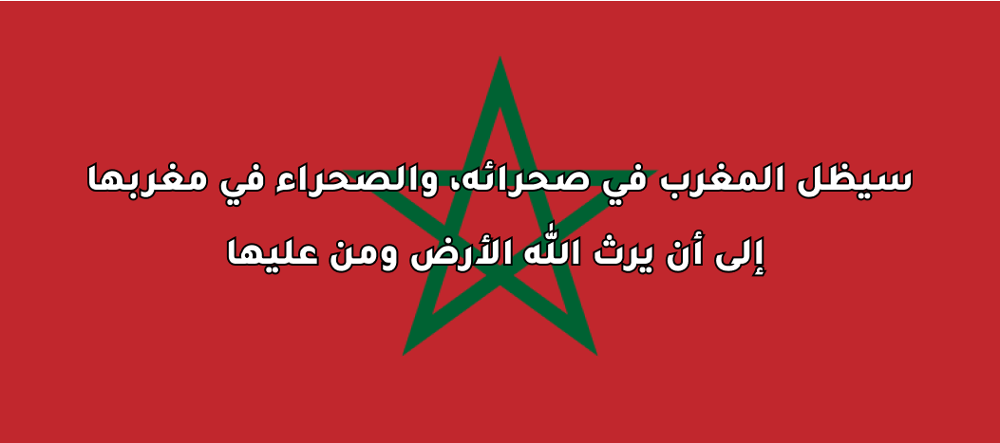

# Morocco Complete Map (GeoJSON & TopoJSON)

This repository contains detailed and simplified GeoJSON and TopoJSON maps of Morocco, along with a world map that correctly includes Morocco's full territory.

## Purpose

This repository aims to provide accurate map data of Morocco for use in GIS, cartography, education, and applications where correct territorial boundaries are important. It also includes a world map with the correct representation of Morocco's borders.

## Why This Repository?

Global maps often inaccurately depict the borders of Morocco. This repository addresses that issue by providing detailed and simplified maps with the correct boundaries.

## Usage

These files can be used in any GeoJSON- or TopoJSON-compatible application, such as:

- [D3.js](https://d3js.org/)
- [Mapbox](https://www.mapbox.com/)
- [Leaflet](https://leafletjs.com/)

## Acknowledgments

A special thank you to [Mapshaper](https://mapshaper.org/) for providing an excellent tool for simplifying and editing GeoJSON and TopoJSON data, which made it possible to refine and prepare these maps for this repository.

### **Created by**

* 🇲🇦 **Mahmoud Zakaria** 
* 🌐 [www.mahmoud.ma](https://www.mahmoud.ma/)
